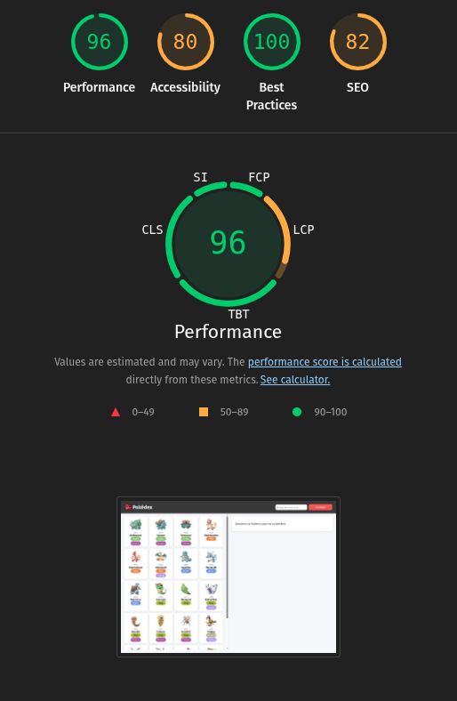

# Projeto Pokédex: Migração Vanilla JS para Next.js

Este repositório documenta a migração técnica de uma aplicação web de listagem de Pokémons. O projeto original foi desenvolvido em **HTML/CSS/JavaScript puro (Vanilla)** e migrado para uma arquitetura moderna baseada em **Next.js (App Router)**, **TypeScript** e **CSS Modules**.

O objetivo principal foi resolver gargalos de performance (como o problema de requisições N+1), melhorar a manutenibilidade do código e aplicar padrões de **HTML Semântico** e **Acessibilidade**.

---

## Arquitetura e Estratégias de Renderização

O projeto utiliza o **App Router** do Next.js para gerenciar rotas e renderização. Abaixo, detalhamos a estratégia escolhida para cada página e a justificativa técnica:

| Página | Rota | Tipo de Renderização | Justificativa |
| :--- | :--- | :--- | :--- |
| **Home** | `/` | **SSG (Static Site Generation)** | A lista inicial de Pokémons é estática e raramente muda. O uso de cache: 'force-cache' permite que o Next.js gere e armazene essa página, entregando-a instantaneamente como um arquivo estático. |
| **Iniciais** | `/starters` | **SSG (Static Site Generation)** | Os dados dos iniciais (IDs e Nomes) foram definidos em constantes (hardcoded). Isso elimina dependências da API e zera o tempo de carregamento (TTFB). |
| **Detalhes** | `/pokemon/[name]` | **SSR (Server-Side Rendering)** | Renderização no servidor sob demanda. Garante que os metadados (SEO) e o conteúdo (stats, types) do Pokémon específico já venham preenchidos no HTML inicial enviado ao navegador.|

---

## 📊 Lighthouse (Antes vs. Depois)

Abaixo, a comparação das métricas de qualidade entre o projeto original e a versão publicada na Vercel.

| Métrica | 🔴 Original (Vanilla JS) | 🟢 Next.js (Atual) | Análise da Variação |
| :--- | :---: | :---: | :--- |
| **Performance** | **96** | **100** | **Performance aumentada:** Mesmo com a renderização quase instantânea do HTML puro, o next.Js se sobrepõe devido sua otimização de imagens e metadados, o que reflete a alte performance e SEO. |
| **Acessibilidade** | **80** | **93** | **Melhoria:** A migração substituiu `divs` genéricas por tags semânticas (`<main>`, `<header>`) e melhorou a estrutura de navegação com o componente `<Link>`, facilitando o uso por leitores de tela. |
| **Best Practices** | **100** | **96** | **Manutenção:** A pontuação permanece em nível de excelência, garantindo segurança (HTTPS) e código moderno. A pequena variação deve-se a avisos de resolução de imagem intrínseca. |
| **SEO** | **82** | **91** | **Ponto de melhora:** A queda ocorre porque a otimização dos metadados dinâmicos não ocorre no HTML puro, o que colabora com a grande diferença entre o Next e o HTML puro. |

## Next.js Lighthouse


## HTML Puro Lighthouse


---

## 🧠 Frontend Desacoplado

Este projeto é um exemplo prático de uma arquitetura de **Frontend Desacoplado (Decoupled Frontend)**.

Diferente de sistemas monolíticos onde o backend gera o HTML, aqui temos uma separação clara:
1.  **Fonte de Dados (PokeAPI):** Atua como um serviço independente, fornecendo apenas dados brutos (JSON). Ela não sabe quem está consumindo os dados.
2.  **Camada de Apresentação (Next.js):** Responsável exclusivamente por buscar esses dados, formatá-los e entregá-los ao usuário.

**Benefícios observados:**
* **Especialização:** Pudemos focar 100% na UX/UI e performance do frontend sem precisar alterar uma linha de código no backend.
* **Resiliência:** Se a API falhar ou mudar, a lógica de tratamento de erro fica isolada no nosso servidor Next.js, protegendo o usuário de falhas catastróficas.
* **Performance:** Pudemos implementar cache e otimização de imagens no nosso servidor intermediário (o Next.js), algo que não poderíamos fazer se estivéssemos consumindo a API diretamente no navegador do cliente sem um intermediário inteligente.

---

### Como Acessar o Projeto

```bash
# Acesse no navegador
https://trab-si2-pokedex-next.vercel.app/
